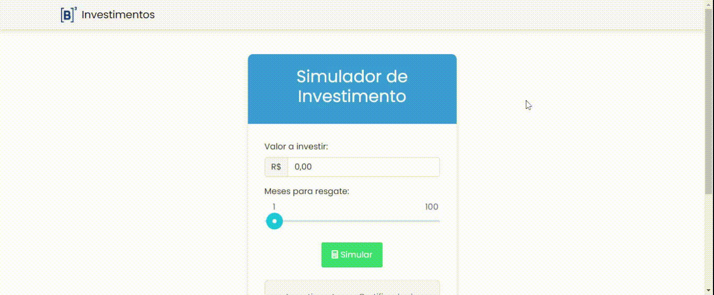

# InvestmentSimulator
Simulador de investimentos feito em .NET Framework 4.8 (WebAPI) e Angular 17 (Frontend).

## Funcionalidade


* O sistema permite que o usuário infome um valor e um prazo em meses para o resgate da aplicação. Após inserir os dados, o usuário pode solicitar o cálculo do investimento. A tela apresentará o resultado bruto e o resultado líquido do investimento.

## Estrutura da aplicação

O backend do sistema foi feito em .NET Framework (WebAPI) e o frontend em Angular 17 (Client), ambos utilizando boas práticas, princípios do SOLID e possuindo uma comunicação Client/Server. Segue arquitetura principal da aplicação:

###### WebApi
```
📁 
  |- 📁 Application
  |    | - 📁 Services (Lógica principal)
  |- 📁 Controllers
  |- 📁 Core
  |   | - 📁 Entities
  |   | - 📁 Interfaces
```
O projeto backend foi estruturado em camadas, a princípio através de pastas, por se tratar de um projeto pequeno. Com esta arquitetura diminui a complexidade e aumenta a performance do carregamento do mesmo, ao mesmo tempo que mantem uma divisão clara das responsabilidades. Obs: Conforme o projeto for crescendo, é interessante fazer essa separação por projetos diferentes (Class Library), interligando-os por meio de referências 
**(Para mais detalhes deixo disponível meu repositório, como exemplo de arquitetura limpa: https://github.com/bpereiraalmeida7/dotnet-clean-arch)**.

###### Client
```
📁 
  |- 📁 core
  |    | - 📁 models
  |    | - 📁 services
  |- 📁 features
  |- 📁 shared
  |   | - 📁 components
  |         | - 📁 footer
  |         | - 📁 header
```
O projeto frontend também utilizando uma arquitetura em camada, dando foco a escalabilidade, performance e manutenção da aplicação.

## Instruções para execução e testes:

###### Execução do projeto:

Backend:

* Baixar e instalar [Visual Studio](https://visualstudio.microsoft.com/pt-br/downloads/), certificando em marcar, na instalação, a opção "Ferramentas de desenvolvimento do .NET Framework 4.8" no item "ASP NET e desenvolvimento web".
    *  Caso seja necessário, seguir o tutorial de instalação a parte, do [.NET Framework](https://learn.microsoft.com/pt-br/dotnet/framework/).
*  Abrir a solution `InvestimentSimulator.sln`, no visual studio.
*  Compilar projeto de WebApi (InvestimentSimulator.WebAPI) individualmente.
*  Compilar projeto de teste (InvestimentSimulator.WebAPI.Tests) individualmente, para que não ocorra erros.
*  Executar projeto no botão de "Play" do VS. Caso haja erro de compilação devido conflitos de versão, limpe e compile individualmente os projetos WebApi e Test, e execute-os novamente. 

Frontend:

*  Instalar [Node v18](https://nodejs.org/en/download)
*  Instalar [NPM](https://angular.io/guide/setup-local#prerequisites)
*  Abrir um terminal dentro da pasta "InvestimentSimulatorClient", e rodar o comando `npm install --force` para instalar as dependências.
*  Ainda no terminal dentro da pasta do client, será necessário executar o comando `npm start`, para inicializar o frontend.
*  Acessar no navegador `http://localhost:4200/`
*  Com ambos projetos em execução, divirta-se! :)

###### Execução dos testes unitários:

Backend:

* No Visual Studio, clique com botão direito em cima do projeto `InvestimentSimulator.WebAPI.Tests`, e clique em "Executar Testes"
* Visualize os casos sendo executados na aba "Gerenciador de Testes".

Frontend:

* Para execução dos testes do frontend existem duas formas:
  * Execute os mesmos passos acima (dos testes do backend), porém com o botão direito em cima do projeto `InvestimentSimulatorClient`.
  * Ou abra um terminal dentro da pasta do projeto client, e rode o comando `npm run test`.

  

